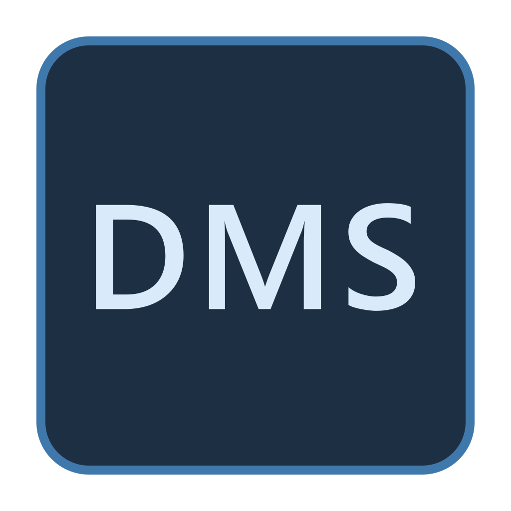
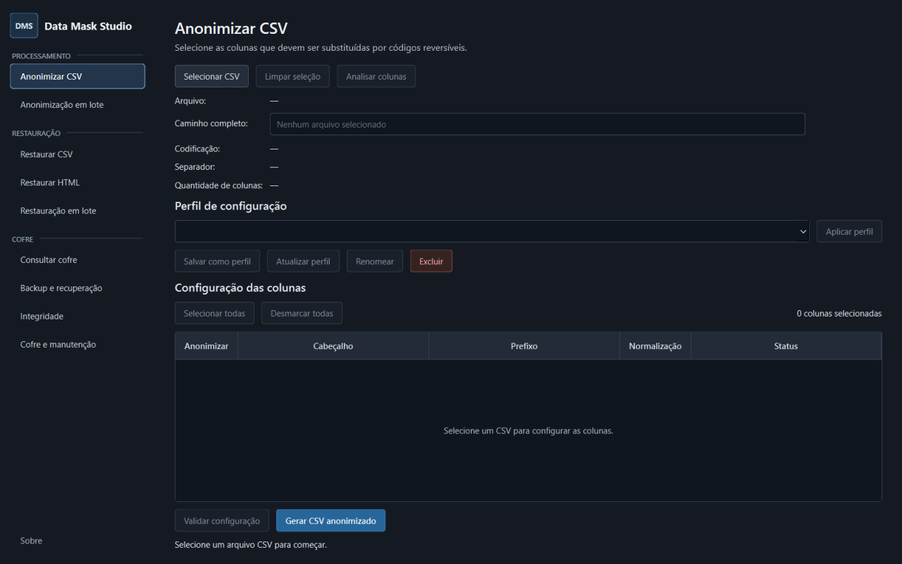

[English](README.md) | Português (Brasil)

<p align="center">
  
</p>

<h1 align="center">Data Mask Studio (DMS)</h1>

<p align="center">
  Ferramenta open source de mascaramento de dados em CSV para Windows, criada por Gustavo Wallace Macedo Santos.
</p>

<p align="center">
  <a href="https://github.com/Gustavo-Wallace/data-mask-studio/actions/workflows/tests.yml"></a>
  <a href="https://github.com/Gustavo-Wallace/data-mask-studio/releases/latest"></a>
  
  
  <a href="LICENSE"></a>
</p>

## Resumo

O Data Mask Studio é uma aplicação desktop para proteger dados sensíveis em arquivos CSV sem enviá-los para serviços externos. Ele oferece mascaramento determinístico com restauração controlada por meio de um cofre local criptografado. Os tokens individuais não contêm nem expõem diretamente o valor original.

A versão atual permite restaurar seletivamente CSVs mascarados e também códigos em arquivos HTML e dashboards locais.

Site oficial: https://gustavo-wallace.github.io/data-mask-studio/pt-br/

GitHub: https://github.com/Gustavo-Wallace/data-mask-studio

## Download da versão mais recente

[**Baixar a versão mais recente**](https://github.com/Gustavo-Wallace/data-mask-studio/releases/latest)

A release contém o instalador por usuário para Windows (`DataMaskStudio-Setup-<versão>.exe`) e o pacote portátil (`DataMaskStudio-Portable-<versão>.zip`). No pacote portátil, extraia toda a pasta antes de executar `DataMaskStudio.exe`.

## Captura da interface

<p align="center">
  
</p>

## Principais recursos

- Mascaramento individual e em lote de CSV.
- Detecção assistida de colunas.
- Tokens determinísticos com restauração controlada.
- Restauração de CSV e HTML.
- Cofre local criptografado.
- Backup portátil protegido por senha.
- Auditoria de integridade, diagnóstico e manutenção.
- Processamento em fluxo para arquivos grandes.
- Operação local sem telemetria.

## Instalação

No instalador, execute o arquivo Setup e siga o assistente. A instalação é feita por usuário. Na versão portátil, extraia o ZIP em uma pasta nova e execute `DataMaskStudio.exe`.

## Fluxo básico

1. Selecione um CSV e escolha as colunas que serão mascaradas.
2. Configure prefixos e normalizações e valide a configuração.
3. Gere o CSV mascarado ou utilize um perfil no processamento em lote.
4. Para recuperar dados tabulares, use a aba “Restaurar CSV”.
5. Para arquivos HTML e dashboards locais, use a aba “Restaurar HTML”.
6. Consulte códigos específicos pelo consultor local quando necessário.

## Segurança e privacidade

O processamento ocorre localmente; arquivos e dados não são enviados automaticamente. As chaves locais são protegidas pelo Windows DPAPI. Consulte a [política de segurança](SECURITY.md) e a [política de privacidade](PRIVACY.md). Isso não representa garantia de segurança absoluta.

Os executáveis ainda não possuem assinatura digital, portanto o Windows pode apresentar um aviso do SmartScreen.

## Arquitetura resumida

A interface desktop em PySide6 coordena serviços separados de processamento de CSV e HTML, perfis, backups e manutenção do cofre. Os mapeamentos sensíveis são protegidos em um cofre SQLite local com AES-256-GCM, enquanto as chaves locais são protegidas pelo Windows DPAPI. Os fluxos de processamento usam memória limitada e publicam arquivos gerados de forma atômica.

## Compatibilidade e recuperação

A série 1.0.x preserva a compatibilidade dos tokens, o schema 3 e backups válidos. Cofres antigos suportados são migrados de forma transacional. Consulte [COMPATIBILITY.md](COMPATIBILITY.md) para o contrato de estabilidade e as orientações de recuperação.

## Execução pelo código-fonte

No Windows PowerShell:

```powershell
git clone https://github.com/Gustavo-Wallace/data-mask-studio.git
cd data-mask-studio
python -m venv .venv
.venv\Scripts\Activate.ps1
python -m pip install --upgrade pip
python -m pip install -e .
python -m data_mask_studio
```

## Limitações

- A distribuição atual é destinada ao Windows por depender do Windows DPAPI.
- Não há sincronização, telemetria, atualização automática ou recuperação remota de chaves.
- Os executáveis não possuem assinatura digital.

## Documentação

- [Histórico de alterações](CHANGELOG.md)
- [Política de segurança](SECURITY.md)
- [Política de privacidade](PRIVACY.md)
- [Compatibilidade e recuperação](COMPATIBILITY.md)

## Licença

O Data Mask Studio é distribuído sob a [GNU General Public License v3.0 only](LICENSE) (`GPL-3.0-only`). Componentes de terceiros permanecem sujeitos às suas próprias licenças.

Criado por Gustavo Wallace Macedo Santos.

Copyright © 2026 Gustavo Wallace Macedo Santos
